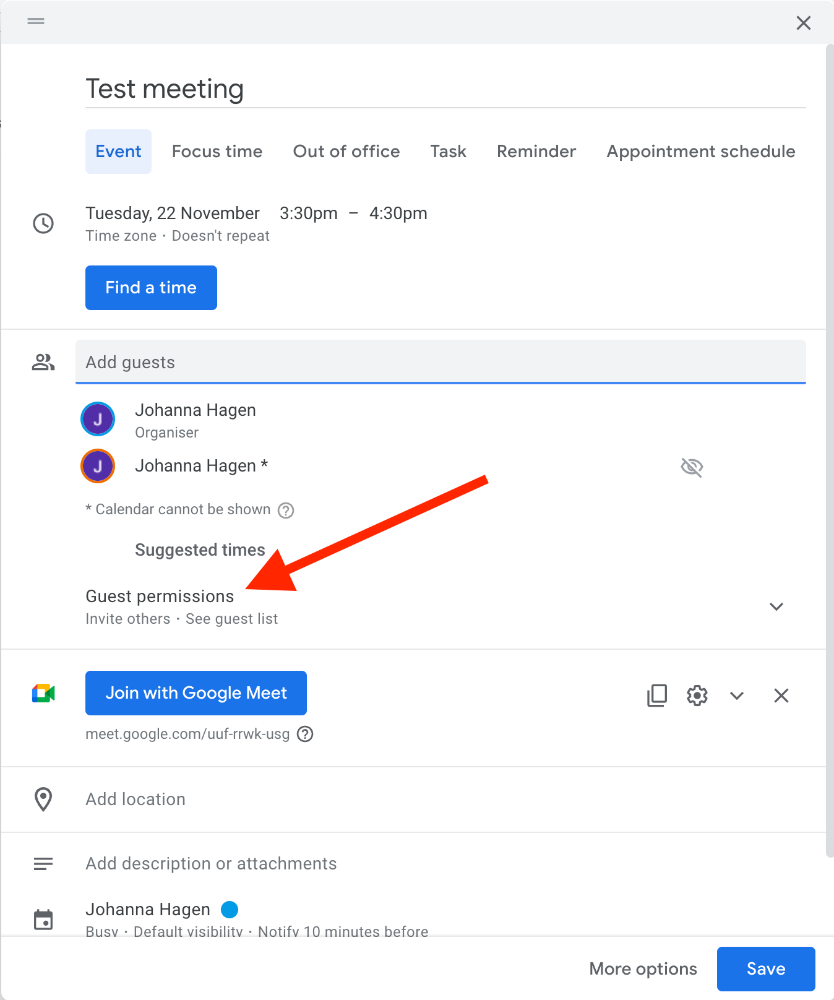

=================================
Google Calendar Invites & Privacy
=================================

.. warning::
   
   This page is under construction. 

-----------
The Problem
-----------

We generally send course attendees a Google Calendar invite for each module, with the
Zoom details in etc. 

If you do this the obvious way, this means everyone can see each other's email address
and you might not want that for privacy and other reasons. 

Here's how to set your Google Meeting up so guest email addresses remain private. 

---------------------
Creating your meeting
---------------------

Add your guests as normal and then click on the "Guest Permissions".

-----------------
Guest Permissions
-----------------

Then you will see something like this

.. image:: images/google-meeting-permissions-before.png

------------------------
The Permissions you want
------------------------

Unckeck all the boxes

.. image:: images/google-meeting-permissions-after.png

-----------------------
Making this the default
-----------------------

If you want you can "Set as default" so those settings are used for all Google Meetings. 

